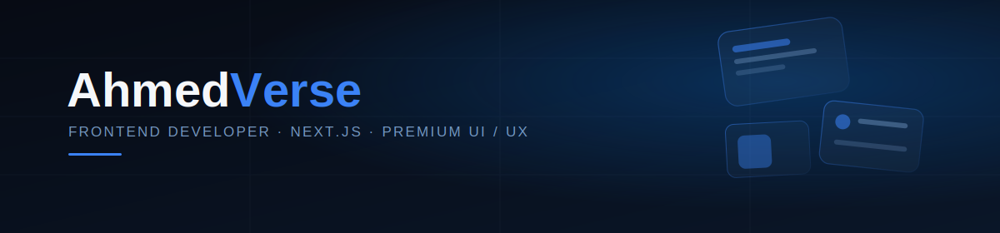
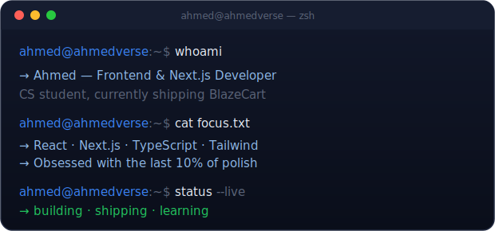

<picture>
  <source media="(prefers-color-scheme: dark)" srcset="./banner-dark.svg">
  <source media="(prefers-color-scheme: light)" srcset="./banner-light.svg">
  
</picture>

 

 

<table>
<tr>
<td width="55%" valign="top">

### Frontend developer who cares more about the last 10% than the first 90%.

I build with Next.js and TypeScript, but the part I actually obsess over is
what happens after the feature "works" — the spacing that's a pixel off,
the transition that's 40ms too slow, the empty state nobody designed.
That gap is where I spend most of my time.

Right now I'm building **BlazeCart**, a full storefront with Stripe,
auth, wishlist, and a dark/light theme system I've broken and fixed more
times than I'd like to admit — which is exactly how you learn what
actually goes wrong in production UI.

**Studying:** Computer Science
**Building:** BlazeCart 🛒
**Learning:** Next.js 16, Prisma, system design

</td>
<td width="45%" valign="top" align="center">

</td>
</tr>
</table>

---

### What I actually reach for

<b>Frontend</b> — click to expand

 

React · Next.js · TypeScript · Tailwind CSS · Bootstrap

<b>Backend</b> — click to expand

 

Node.js · Express.js · Firebase · Supabase

<b>Data</b> — click to expand

 

MongoDB · PostgreSQL · Prisma

<b>Tools</b> — click to expand

 

Git · GitHub · VS Code · Vercel · Figma · Postman

---

### Featured work

<table>
<tr>
<td width="33%" valign="top">

**🛒 BlazeCart**
*Premium ecommerce platform*

`role` full-stack build
`stack` Next.js · Stripe · Prisma
`shipped` Auth, wishlist, dark/light theme, advanced search & filtering

</td>
<td width="33%" valign="top">

**🤖 Helplytics AI**
*AI SaaS dashboard*

`role` frontend + integration
`stack` Next.js · TypeScript · OpenAI
`shipped` Auth, analytics dashboard, embedded AI chat

</td>
<td width="33%" valign="top">

**🌐 AhmedVerse**
*Personal portfolio*

`role` design + build
`stack` React · Framer Motion · Tailwind
`shipped` Glassmorphism UI, motion system, full responsiveness

</td>
</tr>
</table>

---

### The numbers, for what they're worth

*(Green squares are a rough proxy for effort, not a substitute for it.)*

Streak &amp; trophies — click to expand if you're into that

 

 

---

### Now → Later

| Now | Later |
|---|---|
| Shipping BlazeCart's checkout + theme fixes | Contributing to an open-source design system |
| Learning Prisma relations properly, not by trial-and-error | Going deeper on backend architecture |
| Cleaning up motion consistency across pages | Writing about the UI decisions, not just the code |

---

### A few true things

- ☕ Coffee-to-code conversion rate: not great, but consistent.
- 🌙 Dark mode isn't a preference at this point, it's a personality trait.
- 🎨 I will absolutely rebuild a button four times over 2px of padding.
- 💙 Navy blue, always. Ask my color picker history.
- 🐛 Best bugs are the ones that only appear in the theme you didn't test.

---

> If it looks simple, it probably wasn't. That's usually the point.

---

### Reach me

*(LinkedIn / Portfolio / Twitter links are placeholders — swap the `#` for your real URLs, and the email for yours.)*

---

### Support

If any of this was useful to you, a ⭐ on one of my repos does more for
motivation than it should.

