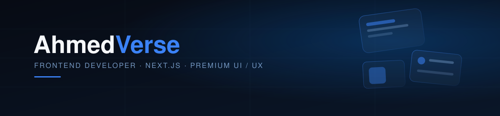
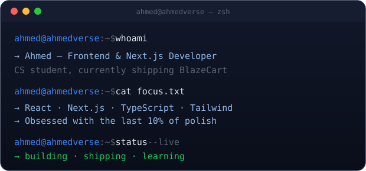

<picture>
  <source media="(prefers-color-scheme: dark)" srcset="./banner-dark.svg">
  <source media="(prefers-color-scheme: light)" srcset="./banner-light.svg">
  
</picture>

 

 

<table>
<tr>
<td width="55%" valign="top">

### Full Stack Developer who cares more about the last 10% than the first 90%.

I build with Next.js and TypeScript, but the part I actually obsess over is
what happens after the feature "works" — the spacing that's a pixel off,
the transition that's 40ms too slow, the empty state nobody designed.
That gap is where I spend most of my time.

Right now I'm building **PULSE**, a premium fitness tracker PWA with
offline support, install-on-device capability, and a dark/light theme
system I've broken and fixed more times than I'd like to admit — which
is exactly how you learn what actually goes wrong in production UI.

**Based in:** Pakistan 🇵🇰
**Building:** PULSE 💓 · [3D Portfolio](https://3d-portfolio-seven-beta-14.vercel.app/)
**Learning:** Three.js, WebGL shaders, system design

</td>
<td width="45%" valign="top" align="center">

</td>
</tr>
</table>

---

### What I actually reach for

<b>Frontend</b> — click to expand

 

React · Next.js 16 · TypeScript · Tailwind CSS v4 · Framer Motion

<b>3D & Motion</b> — click to expand

 

Three.js · React Three Fiber · WebGL · Framer Motion

<b>Backend</b> — click to expand

 

Node.js · Express.js · Firebase · Supabase · Clerk Auth

<b>Data</b> — click to expand

 

MongoDB · PostgreSQL · Prisma · localStorage

<b>Tools</b> — click to expand

 

Git · GitHub · VS Code · Vercel · Figma · Postman

---

### Featured work

<table>
<tr>
<td width="33%" valign="top">

**💓 PULSE**
*Premium fitness tracker PWA*

`role` full-stack build
`stack` Next.js 16 · Clerk · Tailwind v4 · PWA
`shipped` Offline mode, install-to-device, dual theme, workout/nutrition/water tracking

[→ Live Demo](https://fitness-tracker-wheat-eta.vercel.app/)

</td>
<td width="33%" valign="top">

**🎨 3D Portfolio**
*Personal portfolio with 3D experiences*

`role` design + build
`stack` Next.js 16 · Three.js · R3F · Framer Motion
`shipped` Immersive 3D scenes, glassmorphism UI, motion system

[→ Live Demo](https://3d-portfolio-seven-beta-14.vercel.app/)

</td>
<td width="33%" valign="top">

**🤖 Helplytics AI**
*AI SaaS dashboard*

`role` frontend + integration
`stack` Next.js · TypeScript · OpenAI
`shipped` Auth, analytics dashboard, embedded AI chat

</td>
</tr>
</table>

---

### The numbers, for what they're worth

*(Green squares are a rough proxy for effort, not a substitute for it.)*

Streak &amp; trophies — click to expand if you're into that

 

 

---

### Now → Later

| Now | Later |
|---|---|
| Shipping PULSE's PWA install flow + performance polish | Contributing to an open-source design system |
| Learning Three.js shaders properly, not by trial-and-error | Going deeper on backend architecture |
| Cleaning up motion consistency across portfolio pages | Writing about the UI decisions, not just the code |

---

### A few true things

- ☕ Coffee-to-code conversion rate: not great, but consistent.
- 🌙 Dark mode isn't a preference at this point, it's a personality trait.
- 🎨 I will absolutely rebuild a button four times over 2px of padding.
- 💜 Purple gradients, always. Ask my color picker history.
- 🐛 Best bugs are the ones that only appear in the theme you didn't test.

---

> If it looks simple, it probably wasn't. That's usually the point.

---

### Reach me

---

### Support

If any of this was useful to you, a ⭐ on one of my repos does more for
motivation than it should.

